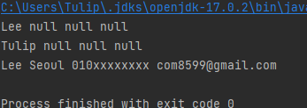

## Chapter8. 참조 자료형에 대해서 더 자세히 알아봅시다.
### 연습문제
1. Student라는 클래스를 만들고, name, address, phone, email이라는 인스턴스 변수를 String 타입으로 선언하자.
    ```java
    public class Student {
        String name;
        String address;
        String phone;
        String email;
    }   
    ```
2. 학생의 정보에 이름은 반드시 입력되어야 하므로, name을 받아서 인스턴스 변수에 할당해 주는 Student 클래스의 생성자를 만들자.
    ```java
    public Student(String name) {
        this.name = name;
    }
    ```
3. 모든 학생의 정보를 생성하면서 할당하는 name, address, phone, email을 매개 변수로 받아 인스턴스 변수에 할당하는 Student 클래스의 생성자를 만들자.
    ```java
    public Student(String name, String address, String phone, String email) {
        this.name = name;
        this.address = address;
        this.phone = phone;
        this.email = email;
    }
    ```
4. 다음과 같이 학생의 정보들을 String으로 리턴하는 toString()이라는 메소드를 만들자.
    ```java
    public String toString() {
        return name + " " + address + " " + phone + " " + email;
    }
    ```
   결과
    ```java
    public String toString() {
        return name + " " + address + " " + phone + " " + email;
    }
    ```
5. 학생 정보를 담아두는 Student 클래스는 다 작성했으니, 학생들을 관리하는 ManageStudent라는 클래스를 만들자.
    ```java
    public class ManageStudent {
    }
    ```
6. ManageStudent 클래스에 main() 메소드를 만들자.
    ```java
    public class ManageStudent {
        public static void main(String[] args) {
    
    
        }
    }
    ```
7. 다음과 같이 배열을 매개 변수로 받아 학생의 정보를 담은 후 리턴하는 메소드를 만들자.
    ```java
    public Student[] addStudent() {
        Student[] student = new Student[3];
        student[0] = new Student("Lim");
        student[1] = new Student("Min");
        student[2] = new Student("Sook", "Seoul", "010xxxxxxxx", "ask@godofjava.com");
        return student;
    }
    ```
   결과
    ```java
    public Student[] addStudent() {
        Student[] student = new Student[3];
        student[0] = new Student("Lee");
        student[1] = new Student("Tulip");
        student[2] = new Student("Lee", "Seoul", "010xxxxxxxx", "com8599@gmail.com");
        return student;
    }
    ```
8. main() 메소드에서 student 라는 이름을 갖는 Student 배열을 만들고, 별도의 초기화는 하지말고, null로 할당하자.
    ```java
    Student[] student = null;
    ```
9. main() 메소드에서 addStudent() 메소드를 호출하고, 그 결과를 student 객체로 받자.
   ```java
    public static void main(String[] args) {
        Student[] student = addStudent();
    }

    public static Student[] addStudent() {
        Student[] student = new Student[3];
        student[0] = new Student("Lee");
        student[1] = new Student("Tulip");
        student[2] = new Student("Lee", "Seoul", "010xxxxxxxx", "com8599@gmail.com");
        return student;
    }
   ```
10. student 객체의 내용을 출력할 printStudents() 라는 메소드를 만들고, 매개 변수로는 student 객체를 받을 수 있도록 하자.
   ```java
    public void printStudents(Student[] students) {
        
    }
   ```
11. printStudents() 메소드에서 for 문을 사용하여 student 배열의 각각의 내용을 출력하자.
   ```java
    public void printStudents(Student[] students) {
        for (Student student : students) {
            System.out.println(student.toString());
        }
    }
   ```
12. main() 메소드에서 printStudents() 메소드를 호출하자.
   ```java
   printStudents(student);
   ```
   
13. ManageStudent 클래스를 컴파일한 후 실행해보자. 결과는 다음과 같이 출력되어야 한다.
   ```text
   Lim null null null
   Min null null null
   Sook Seoul 010XXXXXXXX ask@godofjava.com
   ```
   결과

   