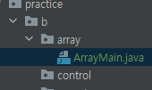
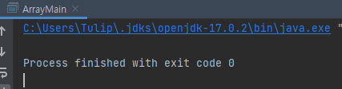
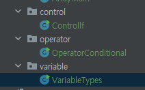

1. godofjava 폴더 아래에 b라는 폴더를 만들자.<br>
   
2. b 폴더 아래에 array, control, operator, variable이라는 폴더를 만들자.<br>
   
3. ArrayMain.java 파일을 godofjava/b/array 폴도로 옮기자.<br>
   
4. ArrayMain.java 파일을 열어 b.array라는 패키지로 선언하자.
   ```java
   package Chapter09.practice.b.array;
   
   public class ArrayMain {
   public static void main(String[] args) {
   
       }
   }
   ```
5. ArrayMain 클래스가 제대로 컴파일되는지 확인해 보자.<br>
   
6. b.control 폴더에는 Controllf, b.operator 폴더에는 OperatorConditional, b.variable 폴더에는 VariableTypes 클래스를 각각 이동하고, 패키지를 선언한 뒤 컴파일 해 보자.<br>
   