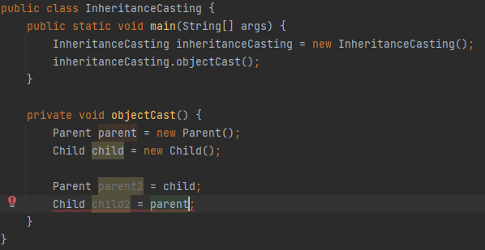

# Chapter 10
## 자바에서 상속이란?

자동으로 부모 클래

## 상속과 생성자
부모 클래스에서는 기본 생성자를 만들어 놓는 것 이외에는 아무런 작업을 할 필요가 없다.

기본 생성자가 없다면 자동으로 기본 생성자를 생성한다.

그런데 부모 클래스에 매개 변수를 받는 메소드가 있고 기본 생성자가 없다면 문제가 생긴다.
아래와 같이 작성할 경우 컴파일 에러를 뱉는다.

```
public class Child extends Parent {
	public Child() {
		System.out.println("Child Constructor");
	}
}
```

```
public class Parent {
	private String name;

	public Parent(String name) {
		this.name = name;
		System.out.println("Parent Constructor");
	}

	public void printName() {
		System.out.println("Parent printName()");
	}
}
```

이러한 문제가 발생하는 이유는 자식 클래스의 생성자가 생성될 때, 부모 클래스의 기본 생성자를 찾는데 기본 생성자가 없기 때문이다.

두가지 해결 방안이 있는데
1. 부모 클래스의 기본 생성자를 만든다
2. super()를 사용한다.

1번 해결방법은 당연한 결과이고 2번 해결 방법은 아래와 같이 작성하면 된다.

```
public class Child extends Parent {
	public Child() {
		super("name");
		System.out.println("Child Constructor");
	}
}
```

super는 부모 클래스의 생성자를 호출한다는 것을 의미한다. 자식 클래스의 생성자에서 super()를 명시적으로 선언하지 않으면 자동으로 추가된다.

또한 부모 클래스의 생성자가 매개변수 타입이나 개수가 다르게 여러개 존재할 때 자식 클래스에서 super(null) 과 같이 어떤 생성자를 호출하는지
애매하게 만들면 컴파일 에러가 발생한다.

## 메소드 Overriding
상속의 관계는 
```
Child 클래스의 기능 > Parent 클래스의 기능 
```
입니다. 

부모 클래스의 메소드를 자식 클래스에서 @Override 를 붙여서 새롭게 메소드를 정의하면 부모 클래스의 메소드를 자식 클래스에서 덮습니다.
생성자의 경우 자동으로 부모 클래스에 있는 생성자를 호출하는 super()가 추가되지만, 메소드는 그렇지 않다.

Overriding 한 메소드의 리턴 타입은 부모와 자식이 같아야한다. 또한 자식 클래스의 접근 제어자가 부모보다 더 확대되는 것은 문제가 안되지만
축소 되는것은 불가능하다.

## 참조 자료형의 형 변환
자식 클래스인 ChildCasting 클래스에서는 부모 클래스인 ParentCasting 크래스에 있는 메소드와 변수들을 사용할 수 있다. 그런데 거꾸로
부모 클래스인 ParentCasting 클래스에서는 ChildCasting 클래스에 있는 모든 메소드의 변수들을 사용할 수 없다.

왜일까?

```
public class Child extends Parent {
	public Child() {
		super("name");
		System.out.println("Child Constructor");
	}

	public Child(String name) {
	}

	public void printName() {
		System.out.println("Child");
	}
}
```

```
public class Parent {
	private String name;

	public Parent() {
	}

	public Parent(String name) {
		this.name = name;
		System.out.println("Parent Constructor");
	}

	public void printName() {
		System.out.println("Parent");
	}
}
```

Parent 클래스에서는 Child 클래스에 있는 모든 메소드와 변수를 사용할 수도 있고, 그렇지 않을 수도 있다. 만약 Child 클래스에
추가된 메소드나 변수가 없으면 가능할 수도 있다. 하지만 자바 컴파일러에서는 자식 객체를 생성할 때 부모 생성자를 사용하면 안 된다고
못을 박아버린다. 명시적으로 형 변환을 한다고 알려줘야만 한다.

int에서 long으로 형 변환이 될 때 볃도의 형 변환 작업을 하지 않았었다. 왜냐하면 데이터의 범위가 넓어지므로 , 값이 바뀌지 않기 때문이다.
하지만, long에서 int로 형 변환을 하려면 값이 바뀔 확률이 있기 때문에, 개발자가 "내가 이건 책임질께"라고 명시적으로 형 변환을 해야한다.

예를 들어 int 자료형의 2의 31승 보다 더 큰 숫자가 long 타입으로 선언되어있을 때 int 자료형으로 전환하면 값이 망가집니다. 
```
long longValue = 2500000000L;
System.out.println(longValue);
int test = (int)longValue;
System.out.println(test);
```

아래와 같이 값이 깨져서 출력된다. 따라서 개발자가 내가 의도한 거야 라고 명시적으로 형 변환을 선언해줘야합니다.

```
2500000000
-1794967296
```

참조 자료형은 자식 클래스의 타입을 부모 클래스의 타입으로 형 변환하면 부모 클래스에서 호출할 수 잇는 메소드들은 자식 클래스에서도
호출할 수 있으므로 전혀 문제가 안된다. 따라서 우리가 명시적으로 형 변환을 해 줄 필요가 없다.

***자식 클래스 객체를 부모 클래스로 선언은 형 변환 필요 x***

아래와 같이 부모 클래스를 자식타입으로 선언하려고하면 컴파일 에러가 발생한다.



아래와 같
```
public class InheritanceCasting {
	public static void main(String[] args) {
		InheritanceCasting inheritanceCasting = new InheritanceCasting();
		inheritanceCasting.objectCast();
	}

	private void objectCast() {
		Parent parent = new Parent();
		Child child = new Child();

		Parent parent2 = child;
		Child child2 = parent;
	}
}
```

아래와 같이 명시적으로 다운 캐스팅하면 컴파일은 가능하다.

```
Child child2 = (Child) parent;

```

그런데 실제로 런을 하면 아래와 같이 parent 객체는 실제로는 Parent 클래스의 객체이므로 컴파일 오류는 넘겼지만,
실행시에는 얘는 Parent 클래스의 객체라서 못쓰겠는데요 라는 에러를 뱉는다.

```
Exception in thread "main" java.lang.ClassCastException: class 이민준.Chapter10.Parent cannot be cast to class 이민준.Chapter10.Child (이민준.Chapter10.Parent and 이민준.Chapter10.Child are in unnamed module of loader 'app')
	at 이민준.Chapter10.InheritanceCasting.objectCast(InheritanceCasting.java:14)
	at 이민준.Chapter10.InheritanceCasting.main(InheritanceCasting.java:6)
```